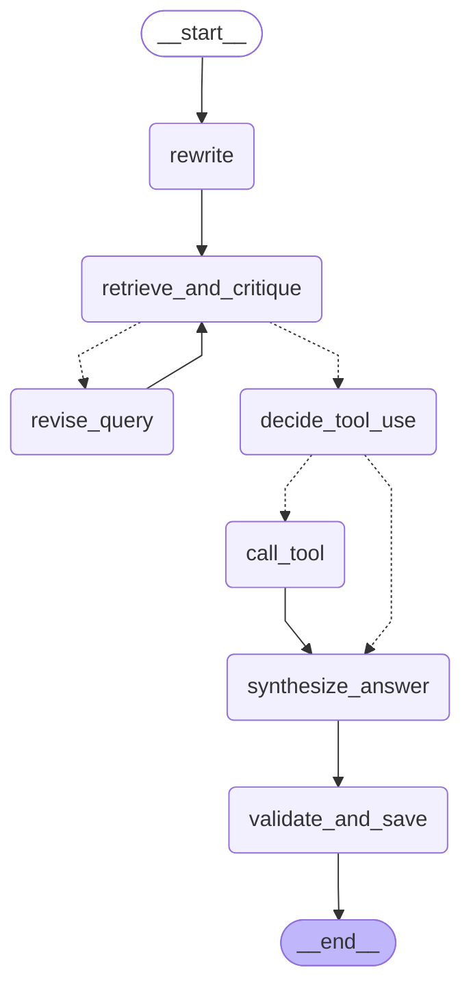

# ARCHITECTURE

## 高层目标

- 面向企业内部软件工程师
- 用 RAG 基于语料回答
- answer 必须带 citations 方便回溯到原文
- 编排层用 LangGraph
- LLM provider 可插拔

## 开源大模型接入

原则 不绑定单一厂商 统一走 OpenAI compatible 接口

- 商业 API 配 `LLM_API_KEY` `LLM_BASE_URL` `LLM_MODEL`
- 开源模型 用 vLLM TGI Ollama 起一个 OpenAI compatible server 再配 `LLM_BASE_URL`

说明 没有 key 时会走 deterministic fallback 先把 RAG 链路和引用跑通
有 key 后再切换到真实 LLM

## 核心模块

- `riskagent_rag.rag`
  - ingest, chunk, index
  - retrieve
- `riskagent_rag.llm`
  - LLM 接入封装
  - OpenAI compatible client
  - fallback client
- `riskagent_rag.agents`
  - retrieval agent
  - explanation agent
  - coordinator

## 数据流

sources -> chunk -> embeddings -> milvus
query -> retrieve -> contexts -> multi-agent -> answer + citations

## LangGraph Agentic Loop 可视化

这是 RiskAgent 项目中 agentic RAG loop 的执行流程图.

### 流程图

### 节点说明

- **查询改写 (rewrite)**: 将用户问题改写为更适合检索的 query
- **检索与评估 (retrieve_and_critique)**: 检索文档并评估质量
- **修订查询 (revise_query)**: 基于 critique 改进 query
- **决策工具调用 (decide_tool_use)**: LLM 决定是否需要调用工具
- **调用工具 (call_tool)**: 调用 DataAgent 获取结构化数据
- **合成答案 (synthesize_answer)**: 基于检索结果和工具输出生成最终答案
- **验证与落盘 (validate_and_save)**: 运行 validator gates 并保存 artifacts

### 查看方式

1. 在 GitHub 上直接查看 (GitHub 原生支持 Mermaid)
2. 使用 Mermaid 在线编辑器: https://mermaid.live/
3. 在支持 Mermaid 的 Markdown 编辑器中查看 (如 Typora, VS Code with Mermaid extension)
4. 在 Gradio UI 的 Inspector → Graph Tab 中查看
