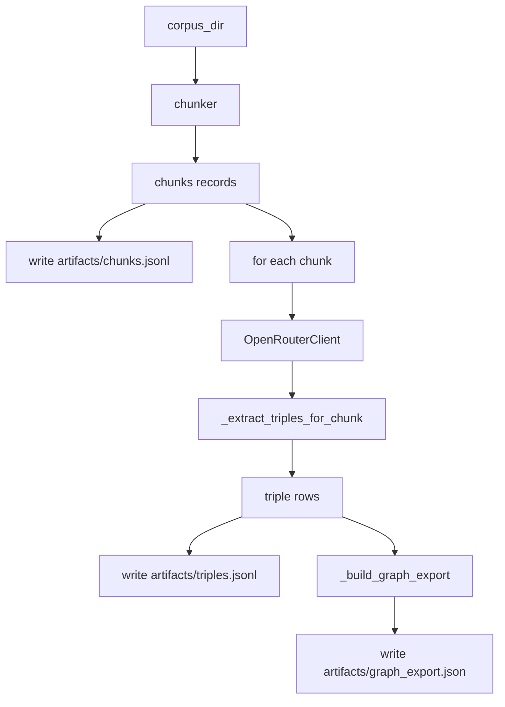
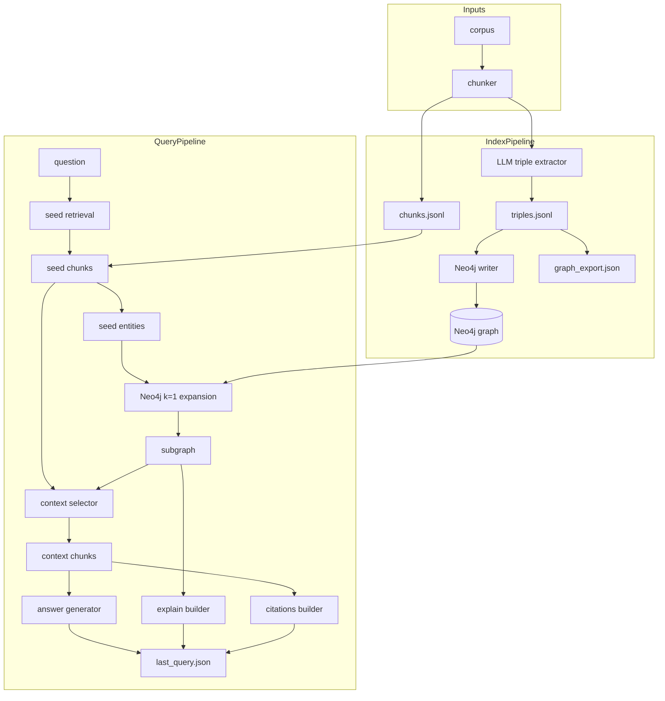

# ARCHITECTURE

我们把项目分成两条线

- index 线, 把语料变成图数据
- query 线, 用图数据增强问答

## 项目名称

RiskKnowledgeGraph-GraphRAG

## Index 流程

index 的目标是把 `corpus_dir` 里的 markdown 语料处理成可回放的 artifacts

- chunks 产物 `artifacts/chunks.jsonl`
- triples 产物 `artifacts/triples.jsonl`
- graph 产物 `artifacts/graph_export.json`

当前实现的代码入口

- CLI 入口 `src/riskknowledgegraph_graphrag/cli/main.py` 里的 `main`
- Pipeline 入口 `src/riskknowledgegraph_graphrag/pipeline.py` 里的 `run_index`
- artifacts 写入 `src/riskknowledgegraph_graphrag/artifacts.py` 里的 `write_jsonl` `write_dataclass_jsonl`

index 的核心步骤

- 读取 `corpus_dir`
- chunking 生成 chunk records
- 写入 `chunks.jsonl`
- 遍历每个 chunk 调用 OpenRouter LLM 抽取 triples
- 聚合 triples 后写入 `triples.jsonl`
- 基于 triples 生成 `graph_export.json`

下面这张图描述了当前 index 的真实数据流





## 关键点

- OpenRouter 只负责 LLM 调用, 所有 key 放在本地 `.env`
- Neo4j 是图数据的主存储, artifacts 里会保存一份文件版本, 方便对比和回放
- explain 和 citations 必须能指回 chunk_id 和 source

## 实体关系抽取策略

### 受控 relation 清单 v1

实体关系抽取要求 LLM 只从固定清单里选 relation
这样更利于归一化 去重 统计 以及后续写入 Neo4j

- IS_A
- ALIAS_OF
- SAME_AS
- RELATED_TO
- PART_OF
- HAS_PART
- MEMBER_OF
- HAS_MEMBER
- DEFINED_BY
- DEFINED_IN
- DERIVED_FROM
- REFERENCES
- REQUIRES
- PROVIDES
- INPUT_TO
- OUTPUT_OF
- CALCULATED_BY
- MEASURED_BY
- APPROXIMATED_BY
- ESTIMATED_BY
- APPLIES_TO
- CONSTRAINED_BY
- LIMITED_BY
- COMPLIES_WITH
- INCREASES
- DECREASES
- INCREASES_RISK
- DECREASES_RISK
- HEDGES
- EXPOSED_TO

### 方向性处理

- 如果语料明确包含方向性信号 抽取为 INCREASES 或 DECREASES
- 如果是风险语境且方向明确 抽取为 INCREASES_RISK 或 DECREASES_RISK
- 如果方向不确定 抽取为 RELATED_TO 并降低 confidence

### 代码落点

- chunking 逻辑在 src/riskknowledgegraph_graphrag/chunking.py
- relation allowlist 和归一化逻辑在 src/riskknowledgegraph_graphrag/relations.py
- 实体关系抽取逻辑在 src/riskknowledgegraph_graphrag/entity_relation_extractor.py
- CLI 命令组织在 src/riskknowledgegraph_graphrag/cli/

## 实体关系抽取 CLI

你可以用单个命令把一个文档送去 LLM 抽 triples 并保存到本地 jsonl
这个 jsonl 可以作为后续归一化和写入 Neo4j 的输入

```bash
python -m riskknowledgegraph_graphrag extract --input-path path/to/doc.md --output-path artifacts/single_doc_triples.jsonl

```
