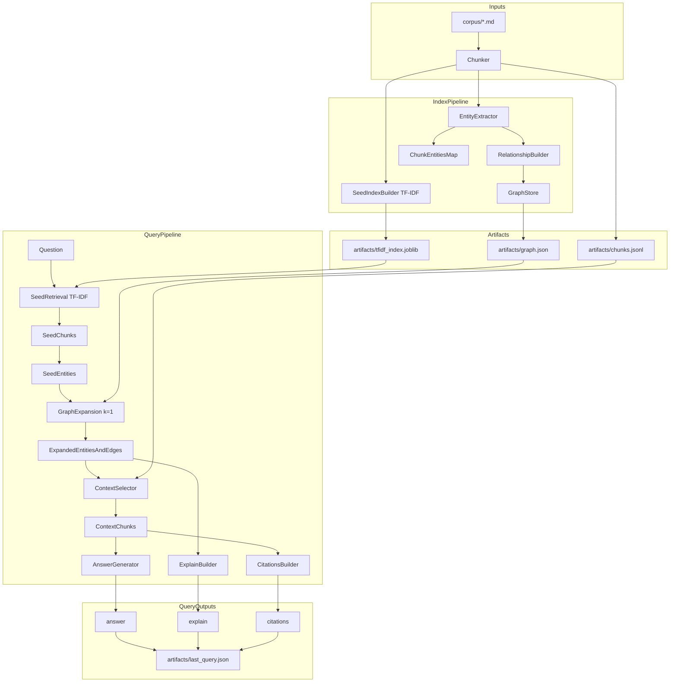

# ARCHITECTURE

```mermaid
graph TD
    subgraph Inputs
        A[corpus/*.md] --> B[Chunker]
    end

    subgraph IndexPipeline
        B --> C[EntityExtractor]
        C --> D[RelationshipBuilder]
        D --> E[GraphStore]
        B --> F[SeedIndexBuilder TF-IDF]
        C --> G[ChunkEntitiesMap]
    end

    subgraph Artifacts
        E --> H[artifacts/graph.json]
        B --> I[artifacts/chunks.jsonl]
        F --> J[artifacts/tfidf_index.joblib]
    end

    subgraph QueryPipeline
        K[Question] --> L[SeedRetrieval TF-IDF]
        L --> M[SeedChunks]
        M --> N[SeedEntities]
        N --> O[GraphExpansion k=1]
        O --> P[ExpandedEntitiesAndEdges]
        P --> Q[ContextSelector]
        Q --> R[ContextChunks]
        R --> S[AnswerGenerator]
        P --> T[ExplainBuilder]
        R --> U[CitationsBuilder]
    end

    H --> O
    I --> Q
    J --> L

    subgraph QueryOutputs
        S --> V[answer]
        T --> W[explain]
        U --> X[citations]
        V --> Y[artifacts/last_query.json]
        W --> Y
        X --> Y
    end
```
