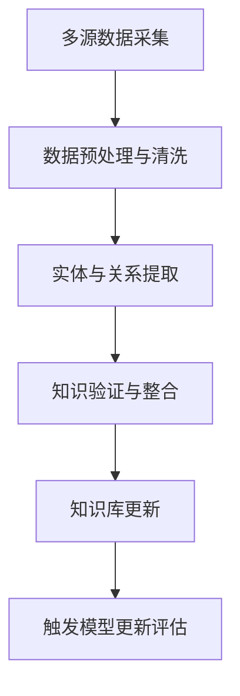
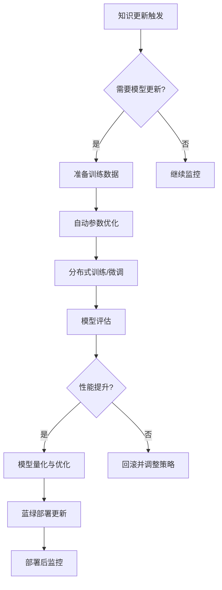

# RiskLLM-DeepSeek

## 项目简介

RiskLLM-DeepSeek 是一个专注于金融风险管理领域的实时自更新私有化大模型部署系统。该项目基于 DeepSeek 大模型，能够持续获取并整合最新的金融市场信息、政治新闻和监管变化，通过自动化的知识更新、微调和部署流程，为金融机构提供始终保持最新状态的风险评估、市场分析和决策支持服务。

## 功能特点

### 实时知识获取与更新
- **多源数据集成**：自动从金融新闻、市场数据、政策公告和社交媒体收集最新信息
- **知识库实时更新**：建立金融领域知识图谱，支持增量更新和知识验证
- **事件监测与分析**：识别重大金融事件和市场异常，提供实时风险预警

### 自主学习与适应
- **自动化微调流水线**：基于新收集的数据自动触发模型微调流程
- **持续评估与优化**：监控模型性能，自动调整训练参数和策略
- **差异化学习**：专注于新出现的金融概念、事件和趋势的学习

### 私有化部署与安全
- **完全私有化部署**：支持本地和私有云环境部署，保障数据安全
- **多级安全防护**：数据加密、访问控制和审计日志，符合金融监管要求
- **资源优化**：支持模型量化、分布式推理和多硬件加速，降低部署成本

### 智能分析与决策支持
- **多模态分析**：整合文本、表格、图表等多种金融数据格式
- **情景模拟**：基于最新市场情况进行风险情景模拟和压力测试
- **可解释决策**：提供模型推理过程和决策依据的详细解释

## 项目结构

```
RiskLLM-DeepSeek/
├── src/                       # 源代码
│   ├── collectors/           # 数据采集模块
│   │   ├── news/            # 新闻和公告采集
│   │   ├── market/          # 市场数据采集
│   │   ├── social/          # 社交媒体监控
│   │   └── regulatory/      # 监管信息采集
│   ├── processors/          # 数据处理模块
│   │   ├── nlp/            # 自然语言处理
│   │   ├── structured/     # 结构化数据处理
│   │   ├── knowledge/      # 知识提取与整合
│   │   └── feature/        # 特征工程
│   ├── model/               # 模型相关模块
│   │   ├── architecture/   # 模型架构定义
│   │   ├── training/       # 训练和微调
│   │   ├── inference/      # 推理优化
│   │   └── evaluation/     # 评估框架
│   ├── knowledge_base/      # 知识库管理
│   │   ├── graph/          # 知识图谱
│   │   ├── vector_store/   # 向量存储
│   │   └── update/         # 增量更新机制
│   ├── pipeline/            # 自动化流水线
│   │   ├── orchestration/  # 流程编排
│   │   ├── triggers/       # 自动触发机制
│   │   └── monitoring/     # 监控和报警
│   ├── api/                 # API服务
│   │   ├── rest/           # REST API接口
│   │   ├── streaming/      # 流式推理接口
│   │   └── admin/          # 管理接口
│   └── security/            # 安全模块
│       ├── encryption/     # 数据加密
│       ├── access/         # 访问控制
│       └── audit/          # 审计日志
├── models/                   # 模型文件
│   ├── base/                # 基础模型
│   ├── finetuned/           # 微调模型
│   └── quantized/           # 量化模型
├── data/                     # 数据目录
│   ├── raw/                 # 原始数据
│   ├── processed/           # 处理后数据
│   ├── historical/          # 历史数据存档
│   └── synthetic/           # 合成数据
├── knowledge/                # 知识库
│   ├── financial/           # 金融知识
│   ├── regulatory/          # 监管知识
│   └── market/              # 市场知识
├── deployment/               # 部署配置
│   ├── docker/              # Docker配置
│   ├── kubernetes/          # K8s配置
│   └── scaling/             # 扩展策略
├── scripts/                  # 脚本
│   ├── training/            # 训练脚本
│   ├── deployment/          # 部署脚本
│   └── maintenance/         # 维护脚本
├── configs/                  # 配置文件
├── docs/                     # 文档
├── notebooks/                # Jupyter笔记本
├── tests/                    # 测试
├── monitoring/               # 监控工具
├── requirements/             # 依赖管理
│   ├── base.txt             # 基础依赖
│   ├── dev.txt              # 开发依赖
│   └── prod.txt             # 生产依赖
├── requirements.txt          # 主依赖文件
├── setup.py                  # 安装脚本
└── README.md                 # 项目说明
```

## 系统工作流程

### 1. 知识获取与更新流程



### 2. 自动化训练与部署流程



## 快速开始

### 环境设置

```bash
# 克隆仓库
git clone git@github.com:Zheng-Chuan/RiskLLM-DeepSeek.git
cd RiskLLM-DeepSeek

# 创建虚拟环境
python -m venv venv
source venv/bin/activate  # 在 Windows 上使用 venv\Scripts\activate

# 安装依赖
pip install -r requirements/dev.txt
```

### 配置数据源

```bash
# 配置数据采集源
python scripts/setup_collectors.py --config configs/sources/financial_news.yaml

# 初始化知识库
python scripts/init_knowledge_base.py --schema configs/knowledge/financial_schema.yaml
```

### 启动自动化流水线

```bash
# 启动数据采集服务
python scripts/run_collector_service.py --config configs/pipeline/collector_config.yaml

# 启动知识更新服务
python scripts/run_knowledge_service.py --config configs/pipeline/knowledge_config.yaml

# 启动模型训练监控
python scripts/run_training_monitor.py --config configs/pipeline/training_config.yaml
```

### 模型部署

```bash
# 本地部署
python scripts/deploy_local.py --model models/finetuned/latest --port 8000

# Kubernetes部署
python scripts/deploy_k8s.py --namespace financial-ai --config configs/deployment/k8s_config.yaml
```

### 监控与管理

```bash
# 启动监控面板
python scripts/run_monitoring_dashboard.py --port 3000

# 查看模型性能报告
python scripts/generate_performance_report.py --days 7 --output reports/weekly_performance.pdf
```

## 应用场景与示例

### 1. 实时市场风险分析

```python
import requests

# 实时市场风险分析
data = {
    "query": "分析美联储最新加息决定对亚洲新兴市场债券的潜在影响",
    "context": {
        "recent_events": ["美联储加息50个基点", "美元指数上涨2.3%"],
        "market_data": {"美国10年期国债收益率": "4.28%", "VIX指数": 22.5},
        "portfolio_exposure": {"新兴市场债券": "32%", "亚洲高收益债": "15%"}
    },
    "parameters": {
        "depth": "comprehensive",  # 简要/标准/全面
        "format": "structured",    # 文本/结构化/图表
        "time_horizon": "short"    # 短期/中期/长期
    }
}

response = requests.post("http://localhost:8000/api/analysis/market-risk", json=data)
print(response.json())
```

### 2. 监管变化影响评估

```python
import requests

# 监管变化影响评估
data = {
    "regulation": "中国银保监会关于金融机构气候风险管理的指导意见",
    "business_context": {
        "industry": "商业银行",
        "operations": ["公司贷款", "项目融资", "债券承销"],
        "regions": ["中国大陆", "香港特区", "新加坡"]
    },
    "analysis_requirements": {
        "compliance_gaps": True,
        "implementation_timeline": True,
        "resource_requirements": True
    }
}

response = requests.post("http://localhost:8000/api/analysis/regulatory-impact", json=data)
print(response.json())
```

### 3. 自动化金融舆情监控

```python
import requests

# 设置舆情监控任务
monitor_config = {
    "entities": ["中国恒大集团", "碧桂园", "万科集团"],
    "topics": ["债务违约", "流动性危机", "监管调查", "重组计划"],
    "sources": ["新闻媒体", "社交平台", "监管公告", "研究报告"],
    "alert_thresholds": {
        "sentiment_change": -0.15,  # 情感值显著下降
        "volume_increase": 200,     # 相关信息量激增
        "key_event_detection": True  # 关键事件检测
    },
    "frequency": "realtime"  # 实时/每小时/每日
}

# 创建监控任务
response = requests.post("http://localhost:8000/api/monitoring/create", json=monitor_config)
monitor_id = response.json()["monitor_id"]

# 获取最新舆情分析
results = requests.get(f"http://localhost:8000/api/monitoring/{monitor_id}/latest")
print(results.json())
```

### 4. 智能投资组合压力测试

```python
import requests

# 投资组合压力测试
portfolio_data = {
    "assets": [
        {"type": "股票", "ticker": "AAPL", "allocation": 0.15},
        {"type": "债券", "ticker": "AGG", "allocation": 0.40},
        {"type": "商品", "ticker": "GLD", "allocation": 0.10},
        {"type": "房地产", "ticker": "VNQ", "allocation": 0.20},
        {"type": "现金", "ticker": "CASH", "allocation": 0.15}
    ],
    "scenarios": [
        "美联储激进加息",
        "中美贸易摩擦升级",
        "全球能源危机",
        "新兴市场债务危机"
    ],
    "custom_parameters": {
        "inflation_shock": 4.5,  # 通胀冲击百分比
        "interest_rate_change": 2.0,  # 利率变化百分点
        "market_volatility_multiplier": 2.5  # 市场波动率倍数
    },
    "risk_metrics": ["VaR", "Expected Shortfall", "最大回撤", "压力Beta"]
}

response = requests.post("http://localhost:8000/api/analysis/stress-test", json=portfolio_data)
print(response.json())
```

## 系统优势

### 1. 知识时效性
- **实时更新**：持续获取最新金融市场动态，确保模型知识始终保持最新
- **事件感知**：能够识别并理解重大金融事件的影响和连锁反应
- **趋势预测**：通过历史数据和最新信息的结合，提供更准确的市场趋势预测

### 2. 私有化与安全
- **数据主权**：所有数据和模型都在用户控制的环境中，确保敏感信息不外泄
- **合规保障**：符合金融行业的严格监管要求，包括数据隐私和安全标准
- **定制化部署**：根据机构规模和需求灵活配置，从单机部署到大规模集群均可支持

### 3. 自主学习能力
- **持续进化**：无需人工干预，自动适应不断变化的金融环境
- **差异化学习**：专注于新出现的金融概念和事件，避免知识陈旧
- **反馈优化**：根据使用反馈自动调整和优化模型性能

## 路线图

### 第一阶段：基础建设 (1-2个月)
- 搭建数据采集管道，接入多种金融信息源
- 部署基础 DeepSeek 模型，实现初步金融领域适配
- 构建知识库架构和更新机制

### 第二阶段：智能增强 (2-3个月)
- 实现自动化微调流水线，支持增量学习
- 开发多模态分析能力，整合结构化和非结构化数据
- 构建高级金融分析功能，如风险评估和情景模拟

### 第三阶段：自主进化 (3-4个月)
- 实现完全自主的知识更新和模型优化
- 开发适应性部署策略，根据负载自动扩展
- 构建全面的性能监控和自诊断系统

## 贡献与支持

我们欢迎各种形式的贡献，包括功能建议、代码贡献和文档改进。请参考 [CONTRIBUTING.md](docs/CONTRIBUTING.md) 了解详细信息。

如需技术支持或合作，请联系项目维护者。

## 许可证

本项目采用 MIT 许可证。详见 [LICENSE](LICENSE) 文件。
