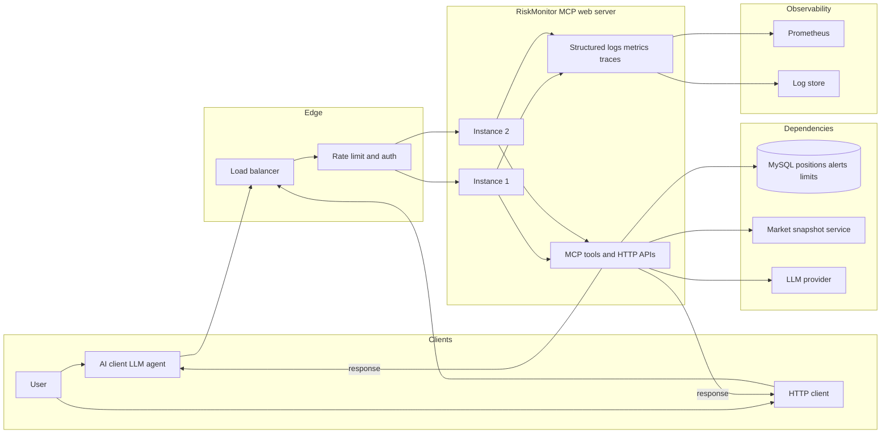
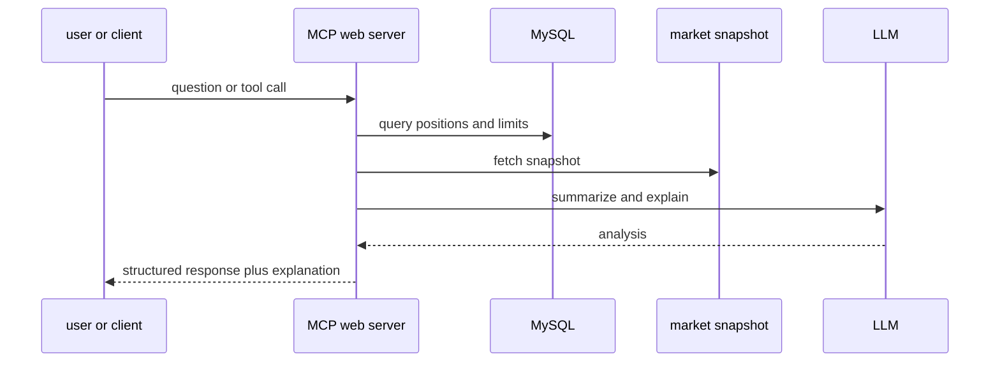
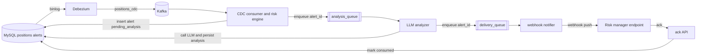
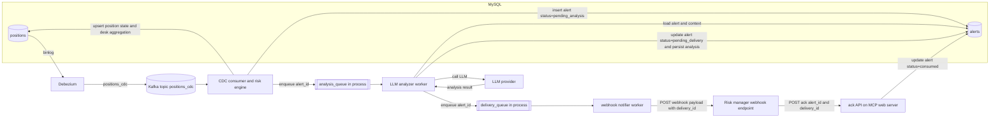
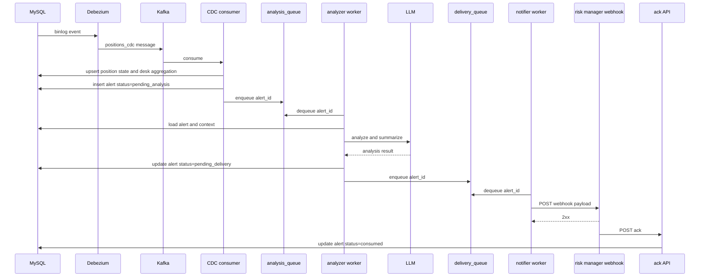

# 系统架构和技术特点

## 项目概述

RiskMonitor-MCP 是一个基于 Model Context Protocol (MCP) 的金融衍生品风险监控服务, 为 AI Agent 提供实时风险计算和监控能力. 项目采用分层架构设计, 实现了从数据访问到业务逻辑的完整闭环.

### 核心功能

- 模块一 交互式问答链路
  - MCP tools, positions 查询, exposure 计算, desk monitor
  - HTTP APIs, health, ready, metrics
  - server 端 LLM 汇总解释, 输出结构化数据和自然语言结论
  - 结构化日志, 指标采集, trace_id request_id 贯穿链路
- 模块二 事件驱动告警链路
  - CDC, Debezium 订阅 MySQL binlog, 输出 positions_cdc
  - risk engine, desk 级聚合与 breach 判断, 单 desk 超限只生成一次告警
  - analyzer, server 端调用 LLM 生成分析结论并落库
  - notifier, webhook 推送给 risk manager, ack 后告警被消费
  - 健壮性, 幂等, 重试, 启动补偿, 端到端时效性

## 架构总览

本项目由两个核心模块组成

- 交互式问答链路
  - 用户主动提问, MCP tools 获取结构化数据, server 端调用 LLM 汇总解释并返回
  - 关注点, 高可用, 可观测, 限流, 失败隔离
- 事件驱动告警链路
  - positions 变更触发 desk 聚合与 breach 判断, server 端调用 LLM 生成结论, webhook 主动推送给 risk manager
  - 关注点, 端到端健壮性, 时效性, 幂等, 可恢复

### 模块一 交互式问答链路

#### 目标

- 为 risk manager 提供可解释的风险问答入口
- 输入支持自然语言和结构化参数
- 输出同时包含结构化 JSON 和可读结论

#### 关键职责

- MCP web server
  - 提供 MCP tools 与 HTTP APIs
  - 组装结构化上下文并调用 LLM
  - 统一错误结构与 request_id
- data access
  - MySQL 查询与错误映射
  - 外部 market snapshot 调用与超时重试

#### 健壮性与高可用

- 多实例部署, 通过 LB 做水平扩展
- readiness 和 graceful shutdown, 避免发布时中断在途请求
- 超时与重试下沉到 data access, 避免 tool 层重复实现
- 限流与隔离, 避免 LLM 或外部依赖抖动导致雪崩

#### 可观测性

- 结构化日志, request_id tool_name latency_ms error_code
- Prometheus 指标, qps p95 latency error_rate

#### 典型时序

### 模块二 事件驱动告警链路

说明

- 主链路以事件驱动为主, 进程内使用 `asyncio.Queue` 做低延迟触发
- 为避免进程重启丢任务, 启动时会补偿 enqueue 未完成告警
- 详细链路见下文 CDC 与告警推送架构

- 目标: positions 变更触发风险聚合, 超限只生成一次告警, server 端调用 LLM 生成分析, webhook 推送给 risk manager, ack 后告警被消费
- 方案: 采用 2A, 进程内 `asyncio.Queue` 做事件驱动, 启动时做补偿扫描避免丢任务

#### 数据流与组件

#### 组件职责

- Debezium
  - 从 MySQL binlog 产出 positions_cdc
  - Kafka message key 使用 Debezium 默认主键 position_id
- CDC consumer and risk engine
  - 消费 positions_cdc, 维护 position 最新状态
  - desk 迁移语义: update 时 desk 变化, 对 before.desk 扣减, 对 after.desk 增加
  - desk level 聚合后触发 breach 判断
  - 超限生成告警并写入 alerts, 初始状态 `pending_analysis`
  - 写库成功后把 `alert_id` 放入 `analysis_queue`
- LLM analyzer worker
  - 从 `analysis_queue` 取 `alert_id`
  - 读取 alerts 记录并补齐上下文数据, 例如 positions 聚合结果, risk_limits, market snapshot
  - 调用 LLM 生成结构化结论和自然语言摘要
  - 更新 alerts 记录, 写入 analysis, 状态置为 `pending_delivery`
  - 把 `alert_id` 放入 `delivery_queue`
- webhook notifier worker
  - 从 `delivery_queue` 取 `alert_id`
  - 读取 alerts 记录并构造 webhook payload
  - 执行 webhook 投递, 支持签名, 幂等, 重试
  - 等待 risk manager 侧 ack, ack 到达后更新 alerts 状态为 `consumed`

#### 启动补偿与恢复

为保证进程重启后仍可继续处理, server 启动时需要执行一次补偿逻辑

- 查询 `status=pending_analysis` 的告警并批量 enqueue 到 `analysis_queue`
- 查询 `status=pending_delivery` 的告警并批量 enqueue 到 `delivery_queue`

补偿逻辑只负责把未完成任务重新放回队列, 具体处理仍由 worker 执行

#### 事件时序

## 技术亮点
